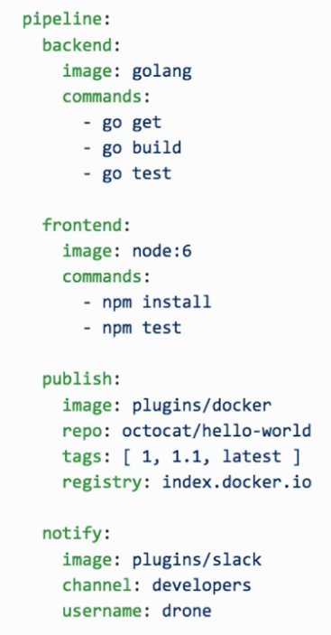

# Drone 基礎認識

## DevOps 工具選擇

DevOps 流程：開發(Develop) -> 測試(CI) -> 部署(CD)

手動測試與部署 -> 用 docker 做三項流程自動化

CI/CD Tools 工具選擇：Bamboo、Jenkins、Drone、Gitlab CI

## 為什麼不用 Jenkins

- 專案設定複雜，安裝眾多 plugin 達成需求
- 渲染編譯環境
- 設定檔版本控制，需安裝 plugin
- 需要肉眼看 XML 設定檔差異
- 開發 Plugin，你需要會 Java
- 後續維護人力？ 設定複雜，久而久之會導致熟悉度降低
- 團隊成長？ 同事無法彼此對 jenkins 熟悉度成長

## 為什麼不用 GitLab CI

- 只支援 GitLab
- 無法支援 Plugin

## Drone 基礎介紹

- 基於容器技術的 CI/CD 系統
- 任何步驟都執行在 Docker 內

    專案流程

    - Git Clone
    - 測試
    - 打包
    - 部署
    - 發送訊息

  都是個別的 docker container 執行，錯誤跟正確訊息依靠 drone 後台顯示

- .drone.yml：使用 yaml 管理專案流程

  

- 支援多數 Git Host

## Drone 基礎架構

- 一個主伺服器，多個代理服務
- 不能同時支援兩個含以上的 Git Host (裝多個 Drone 解決)
- 輕量 http server，僅吃 50 MB 記憶體
- Server：Drone + Docker，用 docker-compose，接 Database。

  Engine 不一定要 docker，可用 binary 跑起來

- Drone Agent：Drone Agent + Docker。

  Engine 這就一定要 docker 了，流程都需要 docker container

## Drone 服務優勢

- 啟動速度超快 (低記憶體用量，20 ~ 50 MB)
- 不需要管理者 (簡單的 UI 介面，專案下 .drone.yml 管理部署)
- 可在本機端運行測試 (Jenkins 無法做到，透過 Drone CLI 執行測試與部署)
- 完全基於 Container 開發，不做互相干擾
- 任何語言都可以寫 Plugin (基於 docker container)
- 支援 matrix 編譯 (多版本 node.js 6 7 8 的編譯支援)
