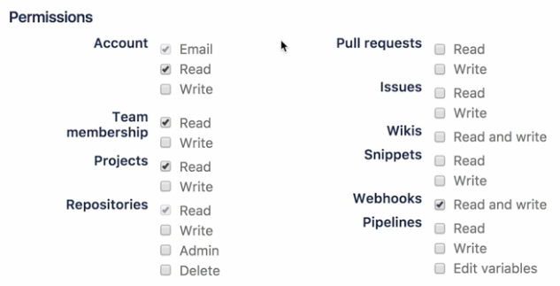

# Drone 安裝方式

## Drone 安裝方式介紹

[http://docs.drone.io/installation/](http://docs.drone.io/installation/)

- Docker Compose
- Binary Install (進階 go 使用者)

docker-compose.yml

- docker pull drone/drone:0.8
- docker pull drone/agent:0.8

```yaml
version: '2'

services:
  drone-server:
    image: drone/drone:0.8

    ports:
      - 8090:8000
      - 9000 # 跟 agent 溝通的 port，在同台 server 的話可以不用
    volumes:
      - ./:/var/lib/drone/ # sqlite database，需要目錄寫入
    restart: always
    environment:
      - DRONE_HOST=http://example.com # run drone 的 public domain
      - DRONE_OPEN=true # Drone 後台開放註冊，團隊都有註冊後就可設定為 false
      - DRONE_SECRET=drone-workshop # Drone server 與 agent 交換的 key
      - DRONE_ADMIN=eden90267 # 務必設定，有兩個帳號用 "," 區分
      # GitHub Config
      - DRONE_GITHUB=true # 啟動 GitHub 模組，可直接與 Github 串接
      - DRONE_GITHUB_CLIENT=${CLIENT}
      - DRONE_GITHUB_SECRET=${SECRET}
      

  drone-agent:
    image: drone/agent:0.8

    command: agent
    restart: always
    depends_on:
      - drone-server
    volumes:
      - /var/run/docker.sock:/var/run/docker.sock # 完全依照 docker，所以要 volume docker.sock
    environment:
      - DRONE_SERVER=drone-server:9000
      - DRONE_SECRET=drone-workshop
      - DRONE_MAX_PROCS=3 # 一個 drone engine 可以 build 幾個專案，記憶體越高這裡可以調越高
```

## Drone 搭配 GitHub

```yaml
version: '2'

services:
  drone-server:
    image: drone/drone:0.8
    ports:
      - 8090:8000
      - 9000
    volumes:
      - ./:/var/lib/drone/
    restart: always
    environment:
      - DRONE_HOST=https://b20cc340.ngrok.io
      - DRONE_OPEN=true
      - DRONE_SECRET=drone-workshop
      - DRONE_ADMIN=eden90267
      # GitHub Config
      - DRONE_GITHUB=true
      - DRONE_GITHUB_CLIENT=${CLIENT} # Github/Settings/Developer settings/OAuth App
      - DRONE_GITHUB_SECRET=${SECRET} # Github/Settings/Developer settings/OAuth App
      

  drone-agent:
    image: drone/agent:0.8
    restart: always
    depends_on:
      - drone-server
    volumes:
      - /var/run/docker.sock:/var/run/docker.sock
    environment:
      - DRONE_SERVER=drone-server:9000
      - DRONE_SECRET=drone-workshop
      - DRONE_MAX_PROCS=3
```

```shell
$ docker-compose up
```

## Drone 搭配 GitLab

```yaml
version: '2'

services:
  drone-server:
    image: drone/drone:0.8
    ports:
      - 8090:8000
      - 9000
    volumes:
      - ./:/var/lib/drone/
    restart: always
    environment:
      - DRONE_HOST=https://b20cc340.ngrok.io
      - DRONE_OPEN=true
      - DRONE_SECRET=drone-workshop
      - DRONE_ADMIN=eden90267
      # GitHub Config
      - DRONE_GITLAB=true
      - DRONE_GITLAB_CLIENT=${CLIENT} # GitLab/Applications
      - DRONE_GITLAB_SECRET=${SECRET} # GitLab/Applications
      - DRONE_GITLAB_URL=https://gitlab.com
      

  drone-agent:
    image: drone/agent:0.8
    restart: always
    depends_on:
      - drone-server
    volumes:
      - /var/run/docker.sock:/var/run/docker.sock
    environment:
      - DRONE_SERVER=drone-server:9000
      - DRONE_SECRET=drone-workshop
      - DRONE_MAX_PROCS=3
```

## Drone 搭配 BitBucket

```yaml
version: '2'

services:
  drone-server:
    image: drone/drone:0.8
    ports:
      - 8090:8000
      - 9000
    volumes:
      - ./:/var/lib/drone/
    restart: always
    environment:
      - DRONE_HOST=https://b20cc340.ngrok.io
      - DRONE_OPEN=true
      - DRONE_SECRET=drone-workshop
      - DRONE_ADMIN=eden90267
      # GitHub Config
      - DRONE_BITBUCKET=true
      - DRONE_BITBUCKET_CLIENT=${CLIENT} # Bitbucket/Bitbucket setting/OAuth 
      - DRONE_BITBUCKET_SECRET=${SECRET} # Bitbucket/Bitbucket setting/OAuth 
      

  drone-agent:
    image: drone/agent:0.8
    restart: always
    depends_on:
      - drone-server
    volumes:
      - /var/run/docker.sock:/var/run/docker.sock
    environment:
      - DRONE_SERVER=drone-server:9000
      - DRONE_SECRET=drone-workshop
      - DRONE_MAX_PROCS=3
```



## Drone 搭配 Gitea

```yaml
version: '2'

services:
  drone-server:
    image: drone/drone:0.8
    ports:
      - 8090:8000
      - 9000
    volumes:
      - ./:/var/lib/drone/
    restart: always
    environment:
      - DRONE_HOST=https://b20cc340.ngrok.io
      - DRONE_OPEN=true
      - DRONE_SECRET=drone-workshop
      - DRONE_ADMIN=eden90267
      # GitHub Config
      - DRONE_GITEA=true
      - DRONE_GITEA_URL=http://gitea.com:2000

  drone-agent:
    image: drone/agent:0.8
    restart: always
    depends_on:
      - drone-server
    volumes:
      - /var/run/docker.sock:/var/run/docker.sock
    environment:
      - DRONE_SERVER=drone-server:9000
      - DRONE_SECRET=drone-workshop
      - DRONE_MAX_PROCS=3
```

Gitea 不支援 OAuth 認證，需帳號密碼

## Drone 安裝在 K8S (AWS)

1. 建立 kubernetes 在 AWS 上面
2. 建立 EBS 空間存放 SQLite

[https://github.com/appleboy/drone-on-kubernetes/blob/master/aws/README.md](https://github.com/appleboy/drone-on-kubernetes/blob/master/aws/README.md)

## Drone 安裝在 K8S (GCP)

Drone 0.8 版在 server 與 agent 溝通上從 WebSocket 調整成 GRPC，造成在 k8s
上的 Drone engine 無法執行任務，需調整回 0.7 版。但這問題未來一定會解決的。

[https://github.com/appleboy/drone-on-kubernetes/tree/master/gke](https://github.com/appleboy/drone-on-kubernetes/tree/master/gke)

