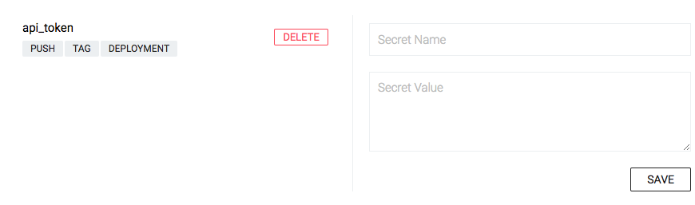

# Drone 基本用法

## Drone 後台管理介面

- Builds
- Badges
- Secrets
- Registry
- Settings

travisCI 對 yaml 限制較多，沒 Drone 強大

## 使用 Git Clone

Drone 的第一個預設動作就是 git clone。但可改變行為：

```yaml
# .drone.yml
clone:
  git:
    image: plugins/git # Drone 自維護的 git image
    depath: 50 # default 也是 50，只抓 commit 前 50 的
    tags: true # 預設 tags 不會下載下來

pipeline:
  node:
    image: node:8.3.0
    commands:
      - yarn install
      - yarn test
```

## Workspace 介紹

```yaml
workspace:
  base: /node # 裡面產生的資料可以在每個 pipeline 全部共享到 (開一個 volume mount 所有 pipeline 的 containers)
  path: drone/node-example # git clone 後要把所有的 source code 到這裡

clone:
  git:
    image: plugins/git
    depath: 50
    tags: true

pipeline:
  node:
    image: node:8.3.0
    commands:
      - yarn install
      - ./node_modules/.bin/mocha
      - touch /node/a.txt

  ls:
    image: node:8.3.0
    commands:
      - ls -al /node/
```

## Pipeline 介紹 (平行執行)

```yaml
pipeline: # 特定字串不得改
  backend: # 名稱可自訂
    image: golang:latest # 自選 Image
    pull: true # 拉最新版，但不建議，直接指定特定版本較穩定
    commands: # 特定字串不得改，以下是類似寫 shell cmd
      - make fmt-check
      - make test
```

commands 會類似寫下列 shell script：

```shell
#!/bin/sh

set -e
make fmt-check
make test
```

Drone 0.7 版後開始支援平行執行，下個 tag (group) 就可以

```yaml
workspace:
  base: /node
  path: drone/node-example

clone:
  git:
    image: plugins/git
    depath: 50
    tags: true

pipeline:
  frontend:
    image: node:8.3.0
    group: testing
    commands:
      - yarn install
      - ./node_modules/.bin/mocha
  backend:
    image: node:8.3.0
    group: testing
    commands:
      - echo "backend testing"

  node1:
    image: node:8.3.0
    group: build
    commands:
      - sleep 5
      - echo "sleep 5"
  node2:
    image: node:8.3.0
    group: build
    commands:
      - sleep 10
      - echo "sleep 10"
  node3:
    image: node:8.3.0
    group: build
    commands:
      - sleep 15
      - echo "sleep 15"
```

## 啟動額外服務 (像是 Redis、MySQL... 等)

跟 docker-compose 差不多

```yaml
services:
  elasticsearch:
    image: docker.elastic.co/elasticsearch

  redis:
    image: redis:latest

  postgres:
    image: postgres:9.5.5
    environment:
      - POSTGRES_DB=homestead
      - POSTGRES_USER=homestead
      - POSTGRES_PASSWORD=secret
```

```yaml
# .drone.yml
workspace:
  base: /node
  path: drone/node-example

clone:
  git:
    image: plugins/git
    depath: 50
    tags: true

pipeline:
  frontend:
    image: node:8.3.0
    group: testing
    commands:
      - sleep 5 # 讓 service 可以啟動成功，沒有時間落差
      - yarn install
      - ./node_modules/.bin/mocha
      - node redis.js

services:
  cache:
    image: redis
```

```javascript
// redis.js
const redis = require("redis"),
  client = redis.createClient({
    host: "cache",
    port: 6379
  });

client.on("error", (err) => {
  console.log("Error " + err);
});

client.set("course", "drone");
client.get("course", (err, reply) => {
  // reply is null when the key is missing
  console.log("course value is " + reply);
});

client.quit();
```

## 隱藏敏感資訊 (像是 AWS Secret 或 API Token)

如何在 Drone 使用敏感資訊，token 之類的，不要寫在程式碼內

有兩種方式：

1. 用 environment

  可用於內部專案，不可用於開源專案 (不推薦使用)

  ```yaml
  pipeline:
    backend:
      image: golang:latest
      pull: true
      environment:
        - api_key=1234567890
      commands:
        - echo ${api_key}
        - echo ${PATH}
        - echo ${PWD}
        - make fmt-check
        - make test
  ```

2. 用 Web 介面管理 (0.8 版後)

  

  ```yaml
  workspace:
    base: /node
    path: drone/node-example
  
  clone:
    git:
      image: plugins/git
      depath: 50
      tags: true
  
  pipeline:
    frontend:
      image: node:8.3.0
      secrets: [ api_token ]
      commands:
        - yarn install
        - ./node_modules/.bin/mocha
        - node env.js
  ```

3. 替代變數

  ```yaml
  workspace:
    base: /node
    path: drone/node-example
  
  clone:
    git:
      image: plugins/git
      depath: 50
      tags: true
  
  pipeline:
    frontend:
      image: node:8.3.0
      secrets:
        - source: api_token
          target: api_token_1
      commands:
        - yarn install
        - ./node_modules/.bin/mocha
        - node env.js
    backend:
      image: node:8.3.0
      secrets:
        - source: api_token
          target: api_token_2
      commands:
        - yarn install
        - ./node_modules/.bin/mocha
        - node env.js
  ```

## 條件子句

Branch, Event, Status, Environment, Matrix

### branch

```yaml
when:
  branch: [ master, develop, prefix/* ]

when:
  branch: 
    include: [ master, release/* ]
    exclude: [ release/1.0.0, release/1.1.* ]
```

### Event

```yaml
when:
  event: [push, pull_request, tag, deployment]
```

### Status

```yaml
when:
  status: [failure, success, changed]
```

針對狀態通知

### Matrix

Open Source 用到的

```yaml
when:
  matrix:
    GO_VERSION: 1.8
    REDIS_VERSION: 2.8
```

### 只有 Pull request 才跑測試

```yaml
when:
  event: [push, pull_request]
  status: [success] # 測試成功才跑 (可不用寫，預設就是如此)
```

#### 實例

```yaml
workspace:
  base: /node
  path: drone/node-example

clone:
  git:
    image: plugins/git
    depath: 50
    tags: true

pipeline:
  master:
    image: node:8.3.0
    commands:
      - echo master
    when:
      branch: master

  develop:
    image: node:8.3.0
    commands:
      - echo develop
    when:
      branch: develop
```

```yaml
workspace:
  base: /node
  path: drone/node-example

clone:
  git:
    image: plugins/git
    depath: 50
    tags: true

pipeline:
  master:
    image: node:8.3.0
    commands:
      - echo master
    when:
      branch: master

  develop:
    image: node:8.3.0
    commands:
      - echo develop
    when:
      branch: develop

  push:
    image: node:8.3.0
    commands:
      - echo push
    when:
      event: [push]

  pull_request:
    image: node:8.3.0
    commands:
      - echo pull_request
    when:
      event: [pull_request]
```

### 只有上傳 tag 才跑部署到 China

```yaml
when:
  event: [tag]
  branch: [refs/tags/china*]
```

#### 實戰

```yaml
workspace:
  base: /node
  path: drone/node-example

clone:
  git:
    image: plugins/git
    depath: 50
    tags: true

pipeline:
  master:
    image: node:8.3.0
    commands:
      - echo master
    when:
      branch: master

  develop:
    image: node:8.3.0
    commands:
      - echo develop
    when:
      branch: develop

  push:
    image: node:8.3.0
    commands:
      - echo push
    when:
      event: [push]

  pull_request:
    image: node:8.3.0
    commands:
      - echo pull_request
    when:
      event: [pull_request]

  tags:
    image: node:8.3.0
    commands:
      - echo tage
    when:
      event: [tag]
```

### 成功或失敗都通知訊息

```yaml
when:
  status: [ success, failure ]
```

#### 實例

```yaml
workspace:
  base: /node
  path: drone/node-example

clone:
  git:
    image: plugins/git
    depath: 50
    tags: true

pipeline:
  fail:
    image: node:8.3.0
    commands:
      - exit 1

  master:
    image: node:8.3.0
    commands:
      - echo master
    when:
      branch: master

  develop:
    image: node:8.3.0
    commands:
      - echo develop
    when:
      branch: develop

  push:
    image: node:8.3.0
    commands:
      - echo push
    when:
      event: [push]

  pull_request:
    image: node:8.3.0
    commands:
      - echo pull_request
    when:
      event: [pull_request]

  tags:
    image: node:8.3.0
    commands:
      - echo tags
    when:
      event: [tag]

  success:
    image: node:8.3.0
    commands:
      - echo success

  notify:
    image: node:8.3.0
    commands:
      - echo notify
    when:
      status: [failure]
```